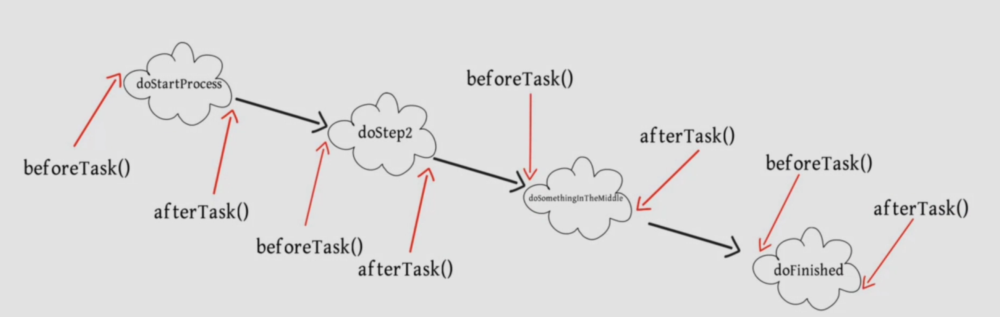

# Gradle things


### declaring a variable
```
def x = 5
def vari= "String"
def arr=["hey","buddy"]
```
### calling varible in string
```
def x = 5
def firstString = """Hello World ! ${x}
 my 
first 
string
"""
println firstString
````
output 
```
 Hello World ! 5
 my 
first 
string
```

### String interpolationn
```
def mystring = "hey buddy"
println(firstString.toUpperCase())
```

## closers
```
def echoIt = {}
println echoIt() //invoke the closer
println echoIt // print as string 
```
```
def echoIt = {parameter -> 
println(parameter)
}
echoIt("hey closer")
```

### define type of parameter
```
def echoIt = {String parameter -> 
println(parameter)
}
```
-----
### you can define closer by its name also
```
Closure echoIt = {String parameter -> 
println(parameter)
}
echoIt("hey")
```
-----
```
def multipLyByTwo(Closure){
Closure() *2
}
println multipLyByTwo {6}
```
-----

### pass multiple argument with closer
```
def multipLyByTwo(factor,Closure){
Closure() *factor
}

println multipLyByTwo(5,{6})
or 
multipLyByTwo 5 , {7}
```

### closure : adding things without changing class
```
class Car {
    String engineName
    Car(name){
        engineName = name
     }

    def invokeExternal(Closure c ){
        c.delegate = this
        c()
    }
}

def obj= new Car("Ferari")
println obj.engineName
obj.invokeExternal{ println "my own code with changing class"}
```

### Logger
```
logger.info "hello logger"
```

### apply clouser
```
apply{
    println "apply clouser by gradle"
}
```

### Files uses different interface
`init.gradle      ------>>> gradle `// intialization phaze

`settings.gradle  ------>>> settings`  // intialization phaze

`build.gradle     ------>>> project` // configuration phaze

example 
inside `init.gradle` file we have created clouser
```
gradle.ext.timestamp {
    2020
}
```

we can use in `build.gradle` as `gradle.timestamp()` or `project.gradle.timestamp()`
and in `setting.gradle` as `gradle.timestamp()` or `settings.gradle.timestamp()`
```
printlin "time : ${gradle.timestapm()}"
```
if you wannt to get gradle version you cann type `$gradle.gradleVersion`
but if you want to get `init.gradle` file then you can directly type `$gradleVersion` becauser `gradle.` is giving `getGradle()` instance.

### gradle.properties

gradle allows to write key value pair in `gradle.properties` file.. which can be access from `build.gradle` and `setting.gradle` file

```groovy
// gradle.properties
mycustom=ThisIsMyCustom
```
```groovy
//build.gradle
if(gradle.hasProperty('mycustom')){
    logger.info "property found : $gradle.mycustom"
}
else{
logger.info "property not found"
}
``` 

we can extend property in build.gradle file by 
`project.ext`
```groovy
project.ext.sayhello = "hello buddy"
if(gradle.hasProperty('sayhello')){
  logger.info sayhello
}
else{
logger.info "property not found"
}
```

### TASKs 
project is collection of tasks and task is collectionn of actions
```flow
st=>start: Project <Interface>
op=>operation: Task<Interface>
e=>end: Actions<Interface>
st2=>start : second

st(right)->op(right)->e
```
`doFirst` and `doLast` are the funnctions adds first and last of task's action list 

Example
```groovy

defaultTasks 'hello' // it will take hello as default task

task hi
project.hi.doFirst{
    logger.info "hey this is first task to be called"
}
//or
hi.doFirst{
    // ....
}

```
```groovy
task hello{
    description = "hey buddy this is example" // default properties
    group = "Welcome" // default properties

    doFirst{
        println("hey this is first action to be called")
        logger.info "hey this is first action to be called"
    }
    doLast{println("hey this is 2nd last action to be called")

        logger.info "hey this is 2nd last action to be called"
    }
}
// you can call doLast and doFirst as many times.
hello.doLast{
    println("hey this is  3rd lat action to be called")
    logger.info "hey this is  3rd lat action to be called"
}
hello.doLast{
    println("hey this is final last action to be called")
    logger.info "hey this is final last action to be called"
}
hello.doFirst {
    println("this is random task added to doFist")
}

logger.info hello.description

// output 
// > Task :app:hello
// this is random task added to doFist
// hey this is first action to be called
// hey this is 2nd last action to be called
// hey this is  3rd lat action to be called
// hey this is final last action to be called

```
### finding tasks

```groovy
//it will return all task list
tasks.findAll{
    task -> {
        task.name.startWith('someTaskName')
    }
}

```

### Run multiple task at same time
```
defaultTasks 'hi','h2' // it will take hello as default task

task hi{
    println("hi")
}
task hi2{
println("hi2")
}
```
or you can make dependencies for each other
example
```groovy
task hello (dependsOn: ['hello3','hello2']) {
    doFirst{
        println("hey this is first action to be called")
    }
    doLast{
        println("hey this is 2nd last action to be called")
    }
}
task hello4{
    println("printing : hell4")
}
task hello2 (dependsOn: 'hello5'){
    println("printing : hell2")
    doFirst {
        println("printing : hell2 doFirst")
    }
    doLast{
        println("printing : hell2 doLast")
    }
}
task hello3 (dependsOn: 'hello4'){
    println("printing : hell3")
}

task hello5{
    println("printing : hell5")
}
/*
//output
> Configure project :app
printing : hell4
printing : hell2
printing : hell3
printing : hell5

> Task :app:hello5 UP-TO-DATE

> Task :app:hello2
printing : hell2 doFirst
printing : hell2 doLast

> Task :app:hello4 UP-TO-DATE
> Task :app:hello3 UP-TO-DATE

> Task :app:hello
hey this is first action to be called
hey this is 2nd last action to be called


*/

```
you can get above output with below implementation also
```groovy

task hello {
    doFirst{
        println("hey this is first action to be called")
    }
    doLast{
        println("hey this is 2nd last action to be called")
    }
}
task hello4{
    println("printing : hell4")
    doLast{
        println("doLast 4")
    }
}
task hello2 {
    println("printing : hell2")
    doFirst {
        println("printing : hell2 doFirst")
    }
    doLast{
        println("printing : hell2 doLast")
    }
}
task hello3 {
    println("printing : hell3")
    doLast{
        println("doLast 3")
    }
}

task hello5{
    println("printing : hell5")
    doLast{
        println("doLast 5")
    }
}


hello.dependsOn  hello3,hello2
hello2.dependsOn hello5
hello3.dependsOn hello4

// or

hello2.dependsOn tasks.findAll{task -> {task.name.startWith('hello5')}
}
```

### Task Dependency Graph

gradle has 3 phases 
- init
- configuration
- execution

configuration : In this phaze gradle knows what dependencies needs to be run
and creates  <a href="https://en.wikipedia.org/wiki/Directed_acyclic_graph">direct acyclic graph</a>
if you have `hi`and `h2` dependencies which are dependent on `h3` .. then it will execute `hi3` once.. not twice.



#### print task graph
you can find more from this <a href="https://docs.gradle.org/current/javadoc/org/gradle/api/execution/TaskExecutionGraph.html">page</a>
```groovy
 gradle.taskGraph.whenReady {
        println("task graph : $gradle.taskGraph.allTasks")
    }
```
example to change version in project
```
task hello {
    doFirst{
        println("hey this is first action to be called version : $project.version")
    }
}

task hello2 {
    println("printing : hell2")
}
gradle.taskGraph.whenReady { taskgraph ->
        println("task graph : $gradle.taskGraph.allTasks")
        if(taskgraph.hasTask(hello2)){
            println("taskPresent")
            project.version="2.0"
        }
        else{
            println("taskNotPresent")
            project.version="2.0-Snap"
        }
}


```

#### want to execute some code after and before tasks
```groovy
 gradle.taskGraph.beforeTask {task->
    println("------ Before task : $task.name")
}

gradle.taskGraph.afterTask {task->
    println("------ After task : $task.name")
}
/*
output
> Task :app:hello3
------ Before task : hello3
doLast 3 version : 2.0
------ After task : hello3
*/
```

### Plugins

whenn we add plugins it just extends properties for that project. example
`apply plugin: 'java-library'`
it will include its tasks, lifecycle tasks,

example 
```groovy
plugin{
    id 'Java' 
}
```
### Repositories
its place  where cached files are stored on cloud like maven, google...
so for gradle to run plugin it needs some jar files.
https://docs.gradle.org/current/dsl/index.html
this will give you reference for various build script blocks that creates or provides for this plugin.
like for mavenCentral() method.. you can look into this link https://docs.gradle.org/current/dsl/org.gradle.api.artifacts.dsl.RepositoryHandler.html 
example
```groovy
repositories{
    mavenCentral()
    // or
    delegate.mavenCentral()
}
```

### Dependencies
its the clouser which tells what coordinates you need
example
```
 dependencies {
    implementation "androidx.coordinatorlayout:coordinatorlayout:1.1.0"
}
```
`androidx.coordinatorlayout` is group name
`coordinatorlayout` is name
`1.1.0` is version


### copy Files
```groovy
// dependsOn is optional
task myTaskName(type: Copy,dependOn 'taskName') {
    from "$buildDir/reports"
    include "*.pdf"
    into "$buildDir/toArchive"
}
```
for More detail you can visit <a href="https://docs.gradle.org/current/userguide/working_with_files.html#sec:copying_single_file_example">Page</a>

### Transitive Dependencies
our dependencies are depend on Direct dependcies but when direct dependencies depend on other dependencies then these 3rd party dependencies called transitive dependencies

```flow
st=>start: Dependences
op=>operation: Direct Dependencies
e=>end: Transitve Dependencies

st(right)->op(right)->e
```

### Analysing Dependencies
to check dependencies
go to app >> tasks >> help >> dependencies .. click and run it.It will show graph in console.

if you want to remove transitive dependencies you can use
example we want to remove `common-logging:common-log:1.1.3`
```groovy
implementation ('androidx.constraintlayout:constraintlayout:1.1.3'){
        exclude group:'common-logging' , module:'common-log'
}
```

### Dependencies Report in html format
add `apply plugin: "project-report"` to plugin
and run command ` ./gradlew htmlDependencyReport`

### Handle Muli-project
if you want to impelemmtn some thing to sub projects then you can use`subproject` in main build.gradle
example 
```groovy
subprojects {
    apply plugin: 'java'
    group = 'com.vishal.com'
    version = '10.1.1'
    sourceCompatibility =  1.8
    targetCompatibility = 1.8

    repositories {
        mavenCentral()
        google()
    }
}
```

Example of external build.gradle

```groovy
//configuring gradle files 

subprojects {
    apply plugin: 'java'
    group = 'com.vishal.com'
    version = '10.1.1'
    sourceCompatibility =  1.8
    targetCompatibility = 1.8

    repositories {
        mavenCentral()
        google()
    }

    
    dependencies{
        // you can put common dependencies here...
    }
}

//"MyRetrofit" this name is same in setting.gralde file..when we include other projects.. 
project(':MyRetrofit'){
    dependencies{

    }
}
project(':Project2'){
    dependencies{

    }
}

project(':Project3'){
    dependencies{
        implementation project(':Project2')
    }
}
```

### change name of subprojects gradle file
```groovy
rootProject.children.each{subproject ->
    subproject.buildFileName="${subproject.name}.gradle"
}
```

### Find bugs


`apply plugin: 'findbugs'`
```groovy
tasks.withType(FindBugs) {
    reports {
        xml.enabled = false
        html.enabled = true
    }
}

```

findbugs has been removed from gradle so there is some alternative also
https://docs.gradle.org/current/userguide/upgrading_version_5.html#the_findbugs_plugin_has_been_removed
 but if you still want to use look here https://findbugs-android.chaitanyapramod.com/

### code checking
see PMD https://docs.gradle.org/current/userguide/pmd_plugin.html#header

### gradle Wrapper
Allows you to run gradle tasks without requiring that gradle  to be installed on your system.

### Difference between api and implementation
